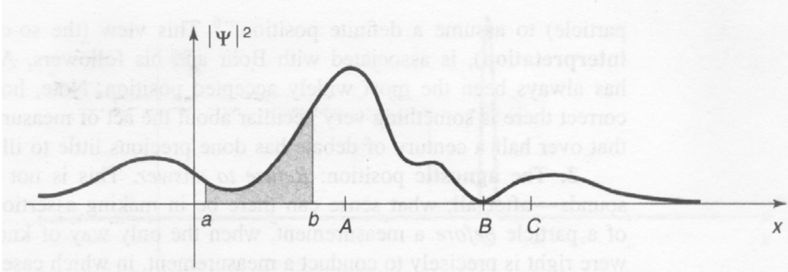
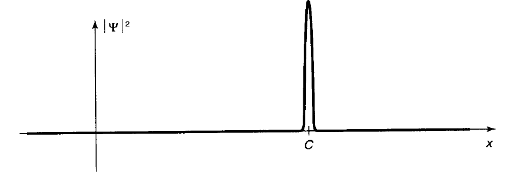
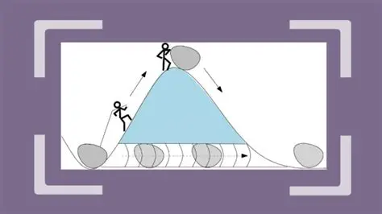
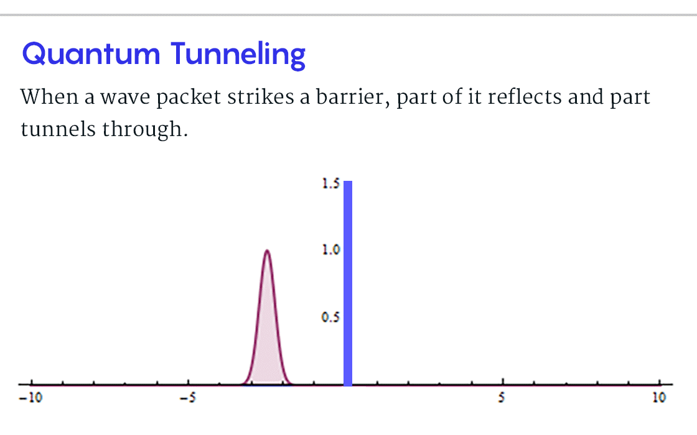

讲起量子力学，很多教材都是直接从薛定谔方程开始的，可我总感觉这会让人莫名其妙，对着一个莫名其妙的方程不知道在讲什么，所以我想从物理学的两朵乌云开始。
# 1 黑体辐射理论的发展
19世纪末，经典物理理论框架被认为近乎完美，人们普遍认为物理学仅需细节完善。开尔文勋爵在这样背景下说“物理学大厦仅剩两朵乌云”，一朵是迈克尔逊-莫雷实验，后来发展成相对论；另一朵就是黑体辐射，后来发展为量子力学。
## 1.1 经典物理的困惑
古斯塔夫·基尔霍夫（Gustav Kirchhoff）提出了一个理想化的模型：黑体（Black Body）。这是一个能吸收所有入射电磁辐射、且不反射也不透射的物体。他也证明了对于任何物体，其发射本领（Emissivity）与吸收本领（Absorptivity）的比值仅是频率和温度的函数，与物体的具体材质无关。（基尔霍夫定律）

但理想的黑体并不存在，人们通常用一个只开一小口的腔体来模拟黑体，光线或电磁波从小孔中入射后会在腔体内多次反射，几乎被腔体完全吸收并辐射能量，极少数从腔体中逃逸，从而达到接近黑体的效果。

在经典热力学框架下，人们发现了两个核心的经验公式。一个是斯特藩-玻尔兹曼定律：黑体单位面积的总辐射功率 $P$ 与绝对温度 $T$ 的四次方成正比：
$$P = \sigma T^4$$
另一个是维恩位移定律：随着温度升高，黑体辐射的光谱峰值波长 $\lambda_{max}$ 会向短波方向移动：

$$\lambda_{max} T = b \quad (b \approx 2.898 \times 10^{-3}\, \text{m}\cdot\text{K}) $$

19世纪末，人们试图用经典电磁学和统计力学解释黑体辐射的光谱分布时，结果却产生了严重的矛盾。维恩位移定律在高频（短波，如紫外区）与实验符合得极好。但在低频（长波，如红外区）明显偏离实验值。

后来瑞利男爵和詹姆斯·金斯基于能量均分定理（每个振动自由度分配 $kT$ 的能量）进行推导。结果在长波区非常吻合。却又导致了紫外灾难 (Ultraviolet Catastrophe)：随着频率 $\nu$ 的增加，公式预测辐射强度将趋于无穷大。这意味着一个加热的烤箱会释放出无限能量的伽马射线，这显然与现实违背。

## 1.2 普朗克量子假说
“量子”这个词在英语里是quantum，直译过来是一定的数量，份额，也有总量、数额的意思，这和量子力学有什么关系呢，得从普朗克开始说。

马克斯·普朗克为了调和维恩公式和瑞利-金斯公式的矛盾，进行了一次瞎猜。通过数学内插法，将长波和短波的两个极限公式缝合在一起，得到了一个与实验数据完美契合的经验公式：

$$\rho(\nu, T) = \frac{8\pi h \nu^3}{c^3} \frac{1}{e^{h\nu/kT} - 1}$$

这个猜出来的公式和实验符合的近乎完美，但是吧，堂堂大物理学家，人家问你公式怎么来的你说猜出来的，这多丢人呀，所以他开始尝试证明或者解释这一公式的物理含义。

这一尝试就出现大问题了，要想解释这个式子的第一项： $\frac{8\pi h \nu^3}{c^3}$ ，避不开的一个问题，只能令能量 $E$ 是：

$$E = n h \nu \quad (n = 1, 2, 3, \dots)$$

这个式子有大麻烦，为什么 $n$ 只能取正整数？这意味着能量是不连续的，是有最小单位的，也就是“quantum”的，量子的。在经典物理里这是完全不可理解的。

## 1.3 能量量子化的不安
虽然普朗克解决了黑体辐射问题，但他对“能量不连续”感到极度不安，认为这只是数学技巧。

1905年爱因斯坦更进一步，提出不仅能量交换是量子的，光本身就是由一份份“光量子”组成的，并成功解释了光电效应。

1912年德拜将量子化概念引入固体热容模型，进一步验证了普朗克常数的普适性。

越来越多的理论逐渐证明，不仅能量是量子的，时间、空间等等等等都是量子的，微观世界的运行原理和宏观世界是完全不同、不可想象的，逐渐诞生了越来越完备的量子力学。

# 2 薛定谔方程的推导
薛定谔方程的出现，是物理学从“粒子性”与“波动性”的矛盾走向统一的过程（关于光到底是粒子还是波，牛顿和和惠更斯争论了一辈子，故后他们的支持者又争论了几个世纪）。这也是量子力学趋于完备的一大进步。

## 2.1 量子化的世界
在解决黑体辐射的“紫外灾难”时，普朗克做出了一个违背祖宗的决定，抛弃了经典物理中能量连续变化的观念。假设频率为 $\nu$ 的谐振子交换能量是不连续的，其最小单位为：

$$E = h\nu$$ 

其中 $h$ 为普朗克常数。这一公式首次将能量（粒子属性）与频率（波动属性）通过一个常数联系了起来。

爱因斯坦将普朗克的概念推广，认为光本身就是粒子（光子）。对于质量为零的光子，结合狭义相对论 $E=pc$ ，可以得到：

$$p = \frac{E}{c} = \frac{h\nu}{c} = \frac{h}{\lambda}$$

1924年，德布罗意大胆设想：既然波动具有粒子性，那么实物粒子（如电子）也应该具有波动性。他给出了著名的**德布罗意关系式**：

$$\lambda = \frac{h}{p} \quad \text{或} \quad p = \hbar k$$

$$E = h\nu = \hbar \omega$$

其中 $\hbar = \frac{h}{2\pi}$ 是约化普朗克常数， $k = \frac{2\pi}{\lambda}$ 是波数， $\omega = 2\pi\nu$ 是角频率。

## 2.2 波函数与薛定谔方程
既然粒子具有波动性，就一定可以用某种波动方程来描述（自由粒子平面波函数——波函数）。对于一个动量为 $p$、能量为 $E$ 的自由粒子，我们可以仿照经典波动方程，将其波函数 $\Psi(x, t)$ 写成单色平面波的形式：

$$\Psi(x, t) = A e^{i(kx - \omega t)}$$

利用德布罗意关系式，将 $k$ 和 $\omega$ 替换为物理量 $p$ 和 $E$：

$$\Psi(x, t) = A e^{\frac{i}{\hbar}(px - Et)}$$

薛定谔的思路是：如果这是一个描述波的方程，那么如何从这个波函数中提取出动能和势能的信息？

对波函数 $\Psi$ 求空间偏导数 $\frac{\partial}{\partial x}$：

$$\frac{\partial \Psi}{\partial x} = \frac{i}{\hbar} p \Psi \implies -i\hbar \frac{\partial}{\partial x} \Psi = p \Psi$$

于是，我们定义了动量算符：

$$\hat{p} = -i\hbar \frac{\partial}{\partial x}$$

对波函数 $\Psi$ 求时间偏导数 $\frac{\partial}{\partial t}$：

$$\frac{\partial \Psi}{\partial t} = -\frac{i}{\hbar} E \Psi \implies i\hbar \frac{\partial}{\partial t} \Psi = E \Psi$$

于是，我们定义了能量算符：

$$\hat{E} = i\hbar \frac{\partial}{\partial t}$$

在经典力学中，体系的总能量（哈密顿量 $H$）等于动能与势能之和：

$$E = \frac{p^2}{2m} + V(x, t)$$

现在，我们将上面得到的算符作用在波函数 $\Psi(x, t)$ 上：左边：使用能量算符替换 $E$：

$$i\hbar \frac{\partial \Psi}{\partial t}$$

右边：使用动量算符替换 $p$（注意 $p^2 \to (-i\hbar \frac{\partial}{\partial x})^2 = -\hbar^2 \frac{\partial^2}{\partial x^2}$）：

$$\left[ -\frac{\hbar^2}{2m} \frac{\partial^2}{\partial x^2} + V(x, t) \right] \Psi$$

将左右结合，便得到了含时薛定谔方程：

$$i\hbar \frac{\partial \Psi(x, t)}{\partial t} = \left[ -\frac{\hbar^2}{2m} \nabla^2 + V(x, t) \right] \Psi(x, t)$$

# 3 薛定谔方程背后的微观世界
薛定谔方程在物理学中的地位，等同于牛顿第二定律之于经典力学。它是描述微观粒子运动状态的核心方程，彻底改变了传统物理对物质世界的认知。

## 3.1 方程的物理意义
薛定谔方程本质上是非相对论下的能量守恒定律在微观世界的数学表现。方程通常可以简写为：

$$\hat{H}\Psi = E\Psi$$

左侧为哈密顿算符 $\hat{H}$ ，代表了体系的总能量运算。它包含两部分：一是动能算项 $-\frac{\hbar^2}{2m}\nabla^2$ 二是势能项 $V$ 。右侧 $E$ ：代表了体系可能的能量观测值。

在经典力学中，我们求解轨迹 $\vec{r}(t)$；而在量子力学中，方程求解的是波函数 $\Psi$。它告诉我们粒子的“状态”，而非确定的路径。能量量子化不再是人为的假设，而是方程在特定边界条件下产生的自然结果（数学物理方程）。

方程的解——波函数也有特殊的物理意义。最初，薛定谔曾认为波函数代表粒子的“电荷密度”被抹平在空间中。但波恩给出了目前公认的概率幅诠释。波函数 $\Psi$ 本身是一个复数，没有直接的物理对应物。但其模的平方代表了粒子在某处出现的概率密度：

$$P(x, t) = |\Psi(x, t)|^2$$

这是一个很耐人寻味的解释，要知道波函数通常是连续的，我们观察下面这样一个波函数：

这个函数在整个实数域内都是非零的，按照波恩的解释，说明这个粒子是以一定概率分布在全空间中任意一点处，只不过处在各点的概率不同，但概率和为1。那为何我们能确切看到一个粒子确切地处在某一点呢？波恩认为，当外界对粒子进行观测时，波函数会发生“塌缩”，塌缩后的波函数在其他区域内值为0，被观测到的区域内概率和为1。

为什么塌缩后的波函数不是一条线而仍是一个很窄的波呢，一方面这是人类测量技术的误差，另一方面是不可测量原理，对一个粒子，测量其位置的误差 $\Delta x$ 与其动量的误差 $\Delta p$ 有：

$$ \Delta x ·\Delta p \geq \frac{\hbar}{2}$$

## 3.2 微观粒子的存在形式
既然粒子是以波函数的形式存在的，那么粒子到底处在什么位置呢？或者说粒子明明是粒子，它在空间中是怎样分布的呢？这一问题有许多种说法，主流的解答有三种，一种认为粒子同时处在波函数所表征的空间中任意位置，以“概率云”的形式分布，当测量发生时塌缩到某一位置；一种认为粒子哪都不在，测量塌缩后粒子才有它的位置；还有一种说法认为讨论这一问题毫无意义，因为测量意味着我们想要知道某一时刻粒子的位置，而测量前的位置有什么意义呢，正因为不在乎才在这一时刻测量，所以讨论测量前的时刻没有任何意义。

既然粒子是以波函数的形式存在，那么房间中的物体当没有人看它的时候它们也是以波的形式分布在空间中的吗？那世界岂不成了主观唯物的了？其实不是的，量子理论中所说的“测量”并不是人们“测量”这一行为，具体要从不可测量原理说起。

不可测量原理说的是不能同时精准测量粒子的位置和动量，这句话很有意思，是不能“同时”“精准”测量，就是说可以同时测但测不准，也可以测得准，但不能同时测。这是为什么呢，物理学主流的解释是所有的测量都是依赖什么东西的，这里说的所依赖的什么东西不是测量的工具，而是光、声波、电磁波之类，按照前面讲过的能量量子化原理，光子也是有动量的，一个光子的能量是 $ E = h\nu $ ，那么其动量为 $p=\sqrt{2mE}$ ，当测量发生时，至少会有一个有动量的光子打在粒子上，这必然引起粒子状态的改变，也就是破坏了粒子原来的状态，虽然这一行为让我们测得了粒子的位置（动量），但这一改变使我们再也不可能准确测得粒子的动量（位置）了。

在这一原理下，“客观唯物主义”也就解释的通了，虽然房间中的物体我们没有去看它，但无时无刻有光照在物体上（即使夜晚也有），哪怕是完全无光的环境，空气中的分子也和物体中的原子时刻发生碰撞，哪怕真空中，物体本身的原子之间也存在相互挤压，宏观世界中物体并不以波函数的形式存在。若要真的制造一个具有波动性的粒子，恐怕需要一个绝对真空的无任何电磁波的环境，并且空间中只有少数粒子存在。

不可测量原理怎样解释宏观世界可以同时测量位置和动量呢？我们再看一眼不可测量原理的表达式：

$$ \Delta x ·\Delta p \geq \frac{\hbar}{2}$$

有没有什么发现？就宏观物体而言 $\Delta p$ 和 $\Delta p$ 都太大了，要知道（约化）普朗克常数的数量级是 $10^{-34}$ ，对宏观物体的测量哪怕我们精确到小数点后十位， $\Delta p$ 与 $\Delta p$ 的乘积都比 $ \frac{\hbar}{2} $ 大十几个数量级。

## 3.3 量子世界性质
薛定谔方程不仅是一个公式，它更揭示了微观世界的运行逻辑

**叠加原理**

由于薛定谔方程是线性微分方程，如果 $\Psi_1$ 和 $\Psi_2$ 是方程的解，那么它们的线性组合 $a\Psi_1 + b\Psi_2$ 也是解。这使得粒子可以同时处于“在这里”和“在那里”的叠加态。只有当你进行观测时，波函数才会“坍缩”到某个确定的本征态。这就是叠加态。

**波粒二象性与不确定性**

方程中包含动量算符（导数项），这意味着波函数的变化率（波长）决定了动量。如果你想把波函数限制在一个极小的空间内（确定位置），波函数的波动就会变得剧烈，从而导致动量的极度不确定。这也是不可测量原理在数学上的证明。

**量子隧穿效应**

在经典力学中，如果粒子的能量 $E$ 小于势垒高度 $V$，粒子会被完全反弹。如下图所示，若山谷中石头的能量小于山顶最高处的势能，则石头永远不可能翻过山顶。

但在量子世界中，这一情况下薛定谔方程在势垒内部仍然有解（尽管是指数衰减的）。这意味着粒子有一定概率穿过山体。如下图所示：

这也是太阳核聚变、STM显微镜以及半导体芯片中漏电现象的根本原因。

# 4 小结
微观世界是完全违背经典常识甚至不可理解的，这是一个概率性、叠加性且互相关联的世界。宇宙在最深处不是由确定的“原子球”组成的，而是由遵循特定波动演化律的“概率波”构成的。

读到这里，学习量子计算所需要的量子力学知识已经基本具备了，期待后面的章节吧~

[返回目录](../readme.md)